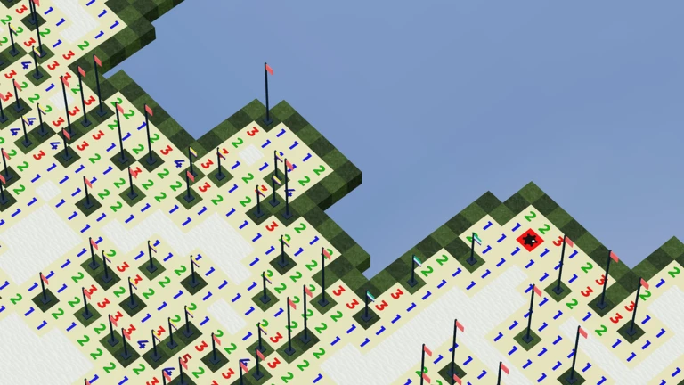

# infinite minesweeper

Source code for [infinite minesweeper](https://www.roblox.com/games/9311627314)

## Why?

As of May 19th, 2026, Roblox requires facial/ID verification to publish games playable by users other than yourself. While infinite minesweeper meets the requirements to remain public, I cannot publish further updates unless I provide personally-identifiable information to a third-party vendor [that has already been compromised.](https://www.malwarebytes.com/blog/news/2026/02/age-verification-vendor-persona-left-frontend-exposed) As a result, I've released the game's source code in an attempt to archive the game in its current state. If anyone wishes to continue infinite minesweeper's development, please refer to the [license](LICENSE) for distribution rights.

## Features

- Deterministic, procedurally generated board
- Square and hexagonal tile shapes
- Optimized board rendering (~10 drawcalls max)
- Serialized board replication
- Structure generation
- Chording
- Strictly-typed data store wrapper
- Customization options
- Server configuration
- Shop
- Player statistics

## Usage

Open the place file provided in `./rbxl/infinite-minesweeper.rbxl` and use
`rojo sync` to sync changes from the file tree.

## License

[GPL v3](LICENSE)
